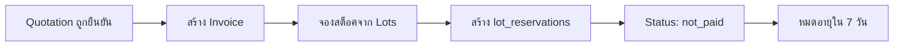
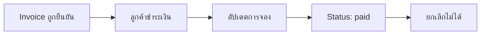
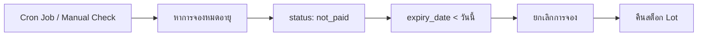

# 📋 Quotation & Invoice Stock Reservation System

## 🎯 ภาพรวมระบบ

ระบบจองสต็อคแบบ Lot-Based สำหรับ Quotation และ Invoice ที่มี 2 สถานะการจอง:

1. **`not_paid`** - จองสำหรับ Quotation (ยกเลิกได้ใน 7 วัน)
2. **`paid`** - จองหลังชำระเงิน Invoice (ยกเลิกไม่ได้)

---

## 🔄 Flow การทำงาน

### **Phase 1: Quotation Confirmed → จองสต็อค (not_paid)**



**การทำงาน:**
1. เมื่อ Quotation ถูกยืนยัน และสร้าง Invoice
2. `SalesService.createInvoiceFromQuotation()` เรียก `InventoryService.reserveStockForQuotation()`
3. ระบบหา **Lots** ที่มีสต็อก (FIFO - First In First Out)
4. สร้าง **lot_reservations** records:
   ```javascript
   {
     lot_id: "402-177-152-08883",
     product_id: "xxx",
     reference_type: "quotation",
     reference_id: "quotation_xxx",
     reserved_meters: 10.5,
     reserved_weight_kg: 3.15,
     status: "not_paid",
     reservation_type: "quotation",
     reserved_date: "2024-11-10T...",
     expiry_date: "2024-11-17T...", // +7 วัน
     notes: "จองสต็อคสำหรับ Quotation (ยังไม่ชำระเงิน - ยกเลิกได้ใน 7 วัน)"
   }
   ```
5. อัปเดต **lot_tracking**:
   ```javascript
   {
     reserved_meters: lot.reserved_meters + reserved_amount,
     available_meters: lot.current_meters - lot.reserved_meters
   }
   ```

---

### **Phase 2: Invoice Confirmed → เปลี่ยนเป็น paid**



**การทำงาน:**
1. เมื่อลูกค้าชำระเงิน
2. `SalesService.recordPayment()` เรียก `InventoryService.confirmReservationPayment()`
3. ระบบหา **lot_reservations** ที่มี `status: not_paid`
4. อัปเดตเป็น:
   ```javascript
   {
     status: "paid",
     reservation_type: "invoice",
     invoice_id: "invoice_xxx",
     confirmed_date: "2024-11-10T...",
     expiry_date: null, // ล้างวันหมดอายุ
     notes: "ชำระเงินแล้ว - ยกเลิกไม่ได้ (Invoice: INV-xxx)"
   }
   ```

---

### **Phase 3: Auto-Cancel Expired Reservations**



**การทำงาน:**
1. เรียก `InventoryService.cancelExpiredReservations()`
2. หาการจองที่:
   - `status: not_paid`
   - `expiry_date < วันนี้`
3. อัปเดตการจอง:
   ```javascript
   {
     status: "cancelled",
     cancelled_date: "2024-11-18T...",
     cancelled_reason: "หมดอายุ (ไม่ชำระเงินภายใน 7 วัน)"
   }
   ```
4. คืนสต็อก **lot_tracking**:
   ```javascript
   {
     reserved_meters: lot.reserved_meters - cancelled_amount
   }
   ```

---

## 📊 Database Schema

### **lot_reservations Collection**

```javascript
{
  _id: ObjectId,
  lot_id: "402-177-152-08883",        // รหัส Lot
  product_id: "product_xxx",          // ID สินค้า
  product_name: "ผ้าฝ้าย สีกรม 152cm",
  
  // Reference
  reference_type: "quotation|invoice", // ประเภทเอกสาร
  reference_id: "quotation_xxx",       // ID เอกสาร
  reference_number: "QT-2024-001",     // เลขที่เอกสาร
  invoice_id: "invoice_xxx",           // (เพิ่มเมื่อชำระเงิน)
  
  // Reservation Details
  reserved_meters: 10.5,
  reserved_weight_kg: 3.15,
  
  // Status & Type
  status: "not_paid|paid|cancelled",   // ✅ สถานะการจอง
  reservation_type: "quotation|invoice",
  
  // Dates
  reserved_date: ISODate,
  confirmed_date: ISODate,             // วันที่ชำระเงิน
  expiry_date: ISODate,                // หมดอายุใน 7 วัน (not_paid เท่านั้น)
  cancelled_date: ISODate,
  
  // Location
  location: "WH01-A-001",
  
  // Notes & Audit
  notes: String,
  cancelled_reason: String,
  created_at: ISODate,
  updated_at: ISODate
}
```

### **lot_tracking Updates**

เพิ่มฟิลด์:
```javascript
{
  // ... existing fields
  reserved_meters: Number,    // เมตรที่ถูกจอง
  available_meters: Number,   // เมตรที่พร้อมใช้ = current_meters - reserved_meters
}
```

---

## 🛠️ API Methods

### **InventoryService**

#### 1. `reserveStockForQuotation(quotationId, items)`
จองสต็อคสำหรับ Quotation (status: not_paid)

**Parameters:**
- `quotationId` - ID ของ Quotation
- `items` - Array ของสินค้าที่ต้องการจอง

**Returns:**
```javascript
{
  success: true,
  reservations: [
    {
      reservation_id: "xxx",
      lot_id: "402-177-152-08883",
      product_id: "xxx",
      reserved_meters: 10.5,
      status: "not_paid"
    }
  ],
  errors: [],
  message: "จองสต็อคสำเร็จทั้งหมด 3 รายการ"
}
```

#### 2. `confirmReservationPayment(quotationId, invoiceId)`
เปลี่ยนสถานะการจองเป็น paid

**Parameters:**
- `quotationId` - ID ของ Quotation
- `invoiceId` - ID ของ Invoice

**Returns:**
```javascript
{
  success: true,
  updated: 3,
  total: 3,
  message: "อัปเดตสถานะการจองเป็น 'paid' สำเร็จ 3 รายการ"
}
```

#### 3. `cancelExpiredReservations()`
ยกเลิกการจองที่หมดอายุ

**Returns:**
```javascript
{
  success: true,
  cancelled: 2,
  total: 2,
  message: "ยกเลิกการจองหมดอายุสำเร็จ 2 รายการ"
}
```

#### 4. `getReservations(referenceType, referenceId)`
ดึงข้อมูลการจอง

**Parameters:**
- `referenceType` - "quotation" หรือ "invoice"
- `referenceId` - ID ของเอกสาร

**Returns:**
```javascript
[
  {
    _id: "xxx",
    lot_id: "402-177-152-08883",
    product_id: "xxx",
    reserved_meters: 10.5,
    status: "not_paid",
    lot_info: [{ /* lot_tracking data */ }]
  }
]
```

---

### **SalesService Integration**

#### การเรียกใช้ใน `createInvoiceFromQuotation()`

```javascript
// Step 8: จองสต็อค
const { inventoryService } = await import('./InventoryService.js')

const reservationResult = await inventoryService.reserveStockForQuotation(
  quotationId,
  quotation.items
)

if (reservationResult.success) {
  // บันทึกข้อมูลการจองใน invoice
  await this.apiRequest.PUT(`sales_invoices/${invoiceId}`, {
    data: {
      stock_reservations: reservationResult.reservations,
      reservation_status: 'not_paid'
    }
  })
}
```

#### การเรียกใช้ใน `recordPayment()`

```javascript
// Step 5: เปลี่ยนสถานะการจอง
const { inventoryService } = await import('./InventoryService.js')

const confirmResult = await inventoryService.confirmReservationPayment(
  invoice.quotation_id,
  invoiceId
)

if (confirmResult.success) {
  console.log('✅ Reservation status updated to paid')
}
```

---

## 🧪 การทดสอบ

### **Test Case 1: สร้าง Invoice และจองสต็อค**

```javascript
// 1. สร้าง Invoice จาก Quotation
const result = await salesService.createInvoiceFromQuotation('quotation_xxx')
// ✅ ระบบจะจองสต็อคอัตโนมัติ (status: not_paid)

// 2. ตรวจสอบการจอง
const reservations = await inventoryService.getReservations('quotation', 'quotation_xxx')
console.log(reservations) // status: "not_paid", expiry_date: วันนี้ + 7 วัน
```

### **Test Case 2: ชำระเงินและเปลี่ยนสถานะ**

```javascript
// 1. บันทึกการชำระเงิน
const paymentResult = await salesService.recordPayment('invoice_xxx', {
  paid_amount: 5000,
  payment_date: new Date().toISOString()
})
// ✅ ระบบจะเปลี่ยนสถานะการจองเป็น paid อัตโนมัติ

// 2. ตรวจสอบการจอง
const reservations = await inventoryService.getReservations('quotation', 'quotation_xxx')
console.log(reservations) // status: "paid", expiry_date: null
```

### **Test Case 3: ยกเลิกการจองหมดอายุ**

```javascript
// 1. เรียกฟังก์ชันยกเลิก (ควรตั้ง Cron Job)
const cancelResult = await inventoryService.cancelExpiredReservations()
console.log(cancelResult) 
// ✅ ยกเลิกการจองที่เกิน 7 วันและคืนสต็อก
```

---

## ⚙️ Setup Cron Job

สำหรับการยกเลิกการจองหมดอายุอัตโนมัติ:

```javascript
// server.js or separate cron service
import cron from 'node-cron'
import { inventoryService } from './services/InventoryService.js'

// รันทุกวันเวลา 00:00
cron.schedule('0 0 * * *', async () => {
  console.log('🔄 Running expired reservation cleanup...')
  
  try {
    const result = await inventoryService.cancelExpiredReservations()
    console.log('✅ Cleanup result:', result)
  } catch (error) {
    console.error('❌ Cleanup failed:', error)
  }
})
```

---

## 🎨 UI Integration

### **Quotation Detail - แสดงสถานะการจอง**

```vue
<template>
  <div v-if="stockReservations.length > 0" class="reservation-status">
    <h4>สถานะการจองสต็อค</h4>
    <div v-for="reservation in stockReservations" :key="reservation._id">
      <div class="reservation-card">
        <span class="lot-badge">{{ reservation.lot_id }}</span>
        <span class="quantity">{{ reservation.reserved_meters }} เมตร</span>
        <span :class="getStatusClass(reservation.status)">
          {{ reservation.status === 'not_paid' ? 'จองไว้ (ยกเลิกได้)' : 'ชำระแล้ว' }}
        </span>
        <span v-if="reservation.expiry_date" class="expiry">
          หมดอายุ: {{ formatDate(reservation.expiry_date) }}
        </span>
      </div>
    </div>
  </div>
</template>
```

### **Invoice Detail - แสดงการยืนยันชำระเงิน**

```vue
<template>
  <div v-if="invoice.payment_status === 'paid'" class="payment-confirmed">
    <div class="alert alert-success">
      <i class="fas fa-check-circle"></i>
      ชำระเงินแล้ว - การจองสต็อคถูกยืนยัน (ยกเลิกไม่ได้)
    </div>
  </div>
</template>
```

---

## ✅ สรุปประโยชน์

1. **ความแม่นยำ** - รู้ว่าจองจาก lot ไหน และสถานะการจอง
2. **Flexible Cancellation** - ยกเลิกได้ภายใน 7 วัน (not_paid)
3. **Payment Protection** - ชำระเงินแล้วยกเลิกไม่ได้ (paid)
4. **Auto Cleanup** - ยกเลิกการจองหมดอายุอัตโนมัติ
5. **FIFO Control** - ใช้สต็อคเก่าก่อน
6. **Traceability** - ติดตามการจองได้ทุกขั้นตอน

---

## 📌 Notes

- **Expiry Period**: 7 วันเป็นค่าเริ่มต้น สามารถปรับได้ตามต้องการ
- **Status Transition**: `not_paid` → `paid` (one-way, cannot reverse)
- **Cancellation**: เฉพาะ `not_paid` เท่านั้นที่ยกเลิกได้
- **Lot Selection**: ใช้ FIFO (First In First Out) strategy

---

**Created**: November 10, 2025  
**Version**: 1.0  
**Author**: ERP Development Team
