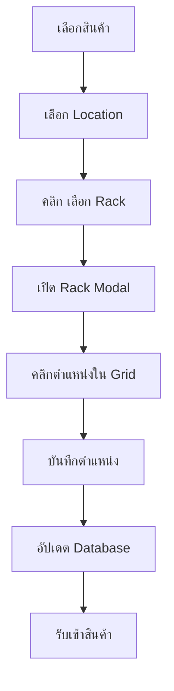

# Rack Position System - ระบบเลือกตำแหน่ง Rack

## 📋 Overview
ระบบเลือกตำแหน่ง Rack สำหรับการรับเข้าสินค้า ช่วยให้สามารถกำหนดตำแหน่งเก็บสินค้าอย่างละเอียดได้ โดยใช้ GUI แบบ 3x3 Grid

## 🎯 Features

### 1. **Rack Position GUI**
- แสดงผัง Rack แบบ 3x3 Grid (A1-A3, B1-B3, C1-C3)
- แสดงสถานะของแต่ละตำแหน่ง (ว่าง/ไม่ว่าง)
- เลือกตำแหน่งได้โดยการคลิก
- แสดงข้อมูลสินค้าที่อยู่ในตำแหน่งนั้น

### 2. **Database Integration**
- บันทึกข้อมูล `rack_position` และ `rack_id` ใน inventory_items
- บันทึกข้อมูล rack position ใน lot_tracking (สำหรับสินค้าผ้า)
- ติดตามการใช้งานตำแหน่งแต่ละช่อง

### 3. **Validation**
- ต้องเลือก Location ก่อนเลือก Rack Position
- ต้องเลือก Rack Position ก่อนสามารถรับเข้าสินค้าได้
- ไม่สามารถเลือกตำแหน่งที่มีสินค้าอยู่แล้ว

## 🛠️ Technical Implementation

### Frontend (goods-receipt/Index.vue)

#### Added Components:
1. **Rack Position Column** - เพิ่มคอลัมน์ใหม่ในตาราง
2. **Rack Selector Modal** - Modal สำหรับเลือกตำแหน่ง
3. **Validation Updates** - อัปเดต validation เพื่อรวม rack_position

#### New States:
```javascript
const showRackModal = ref(false)
const currentRackItem = ref(null)  
const currentRackItemIndex = ref(null)
const selectedRack = ref({ id: 'RCK002' })
const rackPositions = ref([...]) // 3x3 Grid data
```

#### New Methods:
- `openRackSelector()` - เปิด modal เลือก rack
- `selectRackPosition()` - เลือกตำแหน่งใน rack
- `getRackPositionClass()` - กำหนด CSS class ตามสถานะ
- `saveRackPosition()` - บันทึกตำแหน่งที่เลือก
- `closeRackModal()` - ปิด modal

### Backend (InventoryService.js)

#### Database Schema Updates:
```javascript
// inventory_items collection
{
  rack_position: "A1", // ตำแหน่งใน rack (A1-C3)
  rack_id: "RCK002",  // รหัส rack
  // ... existing fields
}

// lot_tracking collection  
{
  rack_position: "A1", // ตำแหน่งใน rack
  rack_id: "RCK002",  // รหัส rack
  // ... existing fields
}
```

#### Updated Functions:
- `processGoodsReceipt()` - รวมข้อมูล rack_position
- `createOrUpdateInventoryItem()` - บันทึก rack_position
- `createLotRecord()` - บันทึก rack_position สำหรับ lot tracking

## 🎨 UI/UX Features

### Rack Layout Visualization
```
┌─────┬─────┬─────┐
│ A1  │ A2  │ A3  │ 
├─────┼─────┼─────┤
│ B1  │ B2  │ B3  │
├─────┼─────┼─────┤  
│ C1  │ C2  │ C3  │
└─────┴─────┴─────┘
    RCK002 - MAIN RACK ID
```

### Status Colors:
- 🟢 **เขียว** - ตำแหน่งว่าง (Available)
- 🔴 **แดง** - ตำแหน่งไม่ว่าง (Occupied) 
- 🔵 **น้ำเงิน** - ตำแหน่งที่เลือก (Selected)

### Position Information:
- แสดงรหัสตำแหน่ง (A1, A2, etc.)
- แสดงรหัสสินค้าที่อยู่ในตำแหน่ง (หากมี)
- แสดงสถานะการเลือก

## 📊 Data Flow



## 🔧 Configuration

### Default Rack Configuration:
```javascript
const selectedRack = ref({ id: 'RCK002' })
const rackPositions = ref([
  // Row A
  { id: 'A1', row: 'A', col: 1, occupied: false },
  { id: 'A2', row: 'A', col: 2, occupied: true, product_code: 'PRD001' },
  { id: 'A3', row: 'A', col: 3, occupied: false },
  // Row B & C...
])
```

### Validation Rules:
1. Location must be selected before Rack Position
2. Rack Position is required for goods receipt
3. Cannot select occupied positions
4. Position is marked as occupied after selection

## 🚀 Usage Example

### Step-by-Step:
1. **เลือก PO** และรายการสินค้า
2. **กรอกจำนวน** ที่รับเข้า
3. **เลือก Location** จาก dropdown
4. **คลิก "เลือก Rack"** เพื่อเปิด modal
5. **เลือกตำแหน่ง** ใน 3x3 Grid
6. **บันทึกตำแหน่ง** และปิด modal
7. **รับเข้าสินค้า** ตามปกติ

### Result:
- สินค้าจะถูกบันทึกพร้อมกับ `rack_position` และ `rack_id`
- ตำแหน่งจะถูกทำเครื่องหมายว่าไม่ว่าง
- ข้อมูลจะปรากฏใน inventory_items และ lot_tracking collections

## 📈 Benefits

1. **Organization** - จัดระเบียบการเก็บสินค้าอย่างเป็นระบบ
2. **Traceability** - ติดตามตำแหน่งสินค้าได้อย่างแม่นยำ
3. **Efficiency** - ประหยัดเวลาในการหาสินค้า
4. **Visual Management** - มองเห็นการใช้งานพื้นที่ได้ชัดเจน
5. **Integration** - เชื่อมโยงกับ Lot Tracking สำหรับสินค้าผ้า

## 🔮 Future Enhancements

1. **Multiple Racks** - รองรับหลาย Rack
2. **Rack Templates** - Template สำหรับ Rack ขนาดต่าง ๆ
3. **Heat Map** - แสดงการใช้งานตำแหน่ง
4. **Auto Assignment** - กำหนดตำแหน่งอัตโนมัติ
5. **Rack Reports** - รายงานการใช้งาน Rack