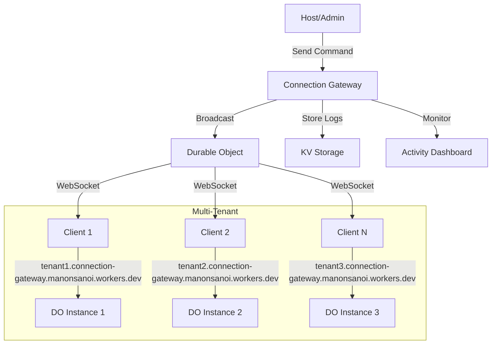

# Connection Gateway & Client Test Panel

## ภาพรวม

ระบบ Connection Gateway เป็น Durable Object Architecture สำหรับการสื่อสาร real-time แบบ multi-tenant ที่ใช้ subdomain เป็นตัวแยก tenant และไม่ต้อง redeploy เมื่อมี tenant ใหม่

## Components ที่สร้างขึ้น

### 1. ConnectionGateway.vue
- **หน้าที่**: จัดการ Durable Object สำหรับ real-time communication
- **ฟีเจอร์**:
  - Multi-tenant Management
  - Command Broadcasting System
  - Use Cases Integration (Help & Support, LMS, Chatroom)
  - Real-time Monitoring
  - Activity Logging

### 2. ClientTestPanel.vue
- **หน้าที่**: จำลอง client สำหรับทดสอบการทำงานของ Gateway
- **ฟีเจอร์**:
  - WebSocket Connection Simulation
  - Command Reception & Processing
  - Real-time Metrics
  - Multi-tenant Testing

### 3. ConnectionGatewayTestPage.vue
- **หน้าที่**: หน้าทดสอบที่แบ่งหน้าจอเป็น 2 ส่วน (Host + Client)
- **ฟีเจอร์**:
  - Split View Interface (Resizable)
  - Real-time Communication Stats
  - Cross-component Event Tracking
  - Quick Actions for Testing

## วิธีการทดสอบ

### 🚀 การเริ่มต้นทดสอบ

#### วิธีที่ 1: Split View Test Page (แนะนำ)
```
เข้าไปที่ /setup/connection-gateway-test
```
- หน้าจอแบ่งเป็น 2 ส่วน: Host (ซ้าย) + Client (ขวา)
- ทดสอบการสื่อสารแบบ real-time ได้ทันที
- ดู stats การทำงานแบบ live

#### วิธีที่ 2: แยกหน้า
1. **เปิด Connection Gateway**
   ```
   เข้าไปที่ /setup/connection-gateway
   ```

2. **เปิด Client Test Panel**
   ```
   เข้าไปที่ /setup/client-test-panel
   ```

### 📋 ขั้นตอนการทดสอบ

#### 1. ทดสอบการเชื่อมต่อ
```javascript
// ใน Client Test Panel
1. เลือก Tenant (tenant1, tenant2, tenant3)
2. คลิก "เชื่อมต่อ"
3. ตรวจสอบสถานะ Connection Status = "CONNECTED"
4. ดู Client Logs เพื่อติดตาม activity
```

#### 2. ทดสอบการส่งคำสั่ง
```javascript
// ใน Connection Gateway
1. คลิก "ส่งคำสั่ง"
2. เลือกประเภทคำสั่ง (notification, quiz, assignment, message, update)
3. กำหนด payload JSON
4. เลือกเป้าหมาย (all หรือ tenant เฉพาะ)
5. คลิก "ส่งคำสั่ง"
```

#### 3. ตรวจสอบการรับคำสั่ง
```javascript
// ใน Client Test Panel
1. ดู "Received Commands" section
2. คลิกที่คำสั่งเพื่อดูรายละเอียด
3. ตรวจสอบ latency และ timestamp
4. ดู Client Logs เพื่อดูการ execute command
```

### 🎯 การทดสอบ Use Cases

#### Help & Support System
```json
{
  "type": "notification",
  "payload": {
    "title": "ตั๋วใหม่",
    "message": "มีตั๋วสนับสนุนใหม่ #12345",
    "ticketId": "12345",
    "priority": "high"
  }
}
```

#### Learning Management System
```json
{
  "type": "quiz",
  "payload": {
    "title": "แบบทดสอบคณิตศาสตร์",
    "questions": 10,
    "timeLimit": 30,
    "subject": "Mathematics"
  }
}
```

#### Chatroom/Collaboration
```json
{
  "type": "message",
  "payload": {
    "from": "Teacher",
    "message": "ประชุมเริ่มแล้ว",
    "roomId": "room-123",
    "urgent": true
  }
}
```

### 📊 การตั้งค่าและการตรวจสอบ

#### ตั้งค่า Client
- **Tenant Selection**: เปลี่ยน tenant เพื่อทดสอบ multi-tenant
- **Client ID**: กำหนด client ID เฉพาะ
- **WebSocket URL**: ดู URL ที่ใช้เชื่อมต่อ

#### ตรวจสอบ Metrics
- **Connection Status**: สถานะการเชื่อมต่อ
- **Messages Received**: จำนวนข้อความที่ได้รับ
- **Average Latency**: ค่าเฉลี่ย latency
- **Uptime**: เวลาที่เชื่อมต่อ

### 🔧 Manual Testing Commands

ใน Client Test Panel มี buttons สำหรับทดสอบคำสั่งต่าง ๆ:
- **Notification Test**: ทดสอบการแจ้งเตือน
- **Quiz Test**: ทดสอบแบบทดสอบ
- **Assignment Test**: ทดสอบงานมอบหมาย
- **Message Test**: ทดสอบข้อความ
- **Update Test**: ทดสอบการอัปเดต

## Architecture Flow



## การใช้งานจริง

### 1. Setup Routing
เพิ่ม routes ในระบบ:
```javascript
{
  path: '/setup/connection-gateway',
  component: () => import('./ConnectionGateway.vue')
},
{
  path: '/setup/client-test-panel',
  component: () => import('./ClientTestPanel.vue')
},
{
  path: '/setup/connection-gateway-test',
  component: () => import('./ConnectionGatewayTestPage.vue')
}
```

### 2. Integration กับระบบจริง

#### Production URLs
- **Base URL**: `https://connection-gateway.manonsanoi.workers.dev`
- **Tenant URL Format**: `https://{tenant}.connection-gateway.manonsanoi.workers.dev/`
- **WebSocket URL Format**: `wss://{tenant}.connection-gateway.manonsanoi.workers.dev/ws`

```javascript
// แทนที่ mock WebSocket ด้วย WebSocket จริง
const tenant = 'tenant1'; // หรือ tenant ID อื่น ๆ
const wsUrl = `wss://${tenant}.connection-gateway.manonsanoi.workers.dev/ws`;
const ws = new WebSocket(wsUrl);

ws.onopen = (event) => {
  console.log('Connected to Gateway:', wsUrl);
};

ws.onmessage = (event) => {
  const command = JSON.parse(event.data);
  this.receiveCommand(command);
};

ws.onclose = (event) => {
  console.log('Disconnected from Gateway');
};

ws.onerror = (error) => {
  console.error('WebSocket error:', error);
};
```

### 3. Production Deployment
- Deploy Durable Object บน Cloudflare Workers
- ตั้งค่า KV Storage สำหรับ logs
- Configure DNS สำหรับ subdomains

## Troubleshooting

### ปัญหาที่อาจพบ
1. **Connection Failed**: ตรวจสอบ WebSocket URL และ network
2. **Commands Not Received**: ตรวจสอบ tenant selection และ connection status
3. **High Latency**: ตรวจสอบ network และ server performance

### Debug Tips
- ใช้ Client Logs เพื่อติดตาม activity
- ตรวจสอบ Network tab ใน Developer Tools
- Monitor Gateway Activity Logs

## Next Steps

1. **Real WebSocket Integration**: เชื่อมต่อกับ WebSocket จริง
2. **Authentication**: เพิ่มระบบ authentication
3. **Message Queuing**: เพิ่มระบบ queue สำหรับ reliability
4. **Monitoring**: เพิ่ม monitoring และ alerting
5. **Load Testing**: ทดสอบ performance ภายใต้ load สูง

---

**หมายเหตุ**: Components นี้เป็น simulation สำหรับการทดสอบ สำหรับการใช้งานจริงต้องเชื่อมต่อกับ Durable Object และ WebSocket จริง 